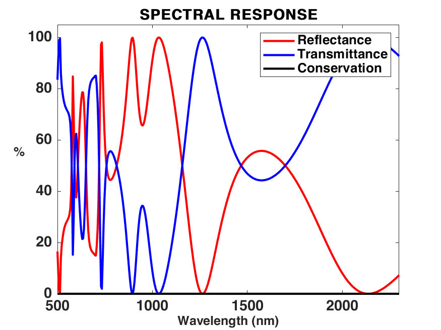
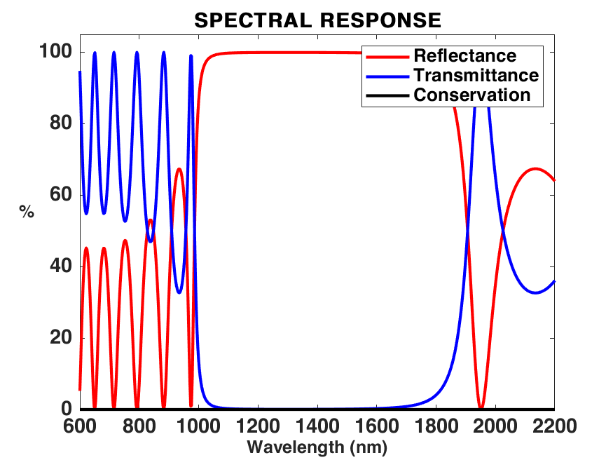
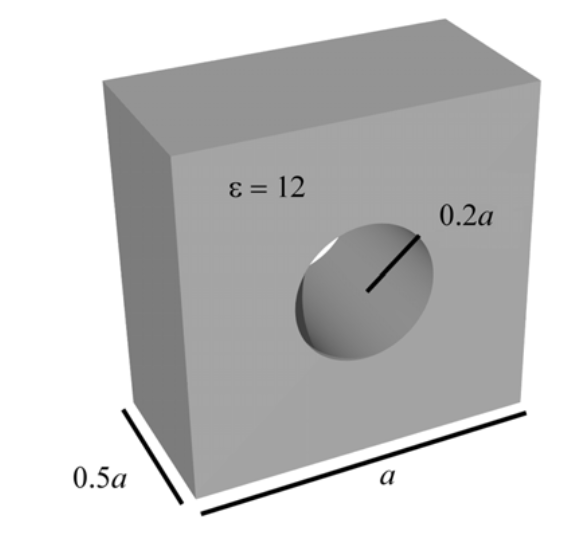
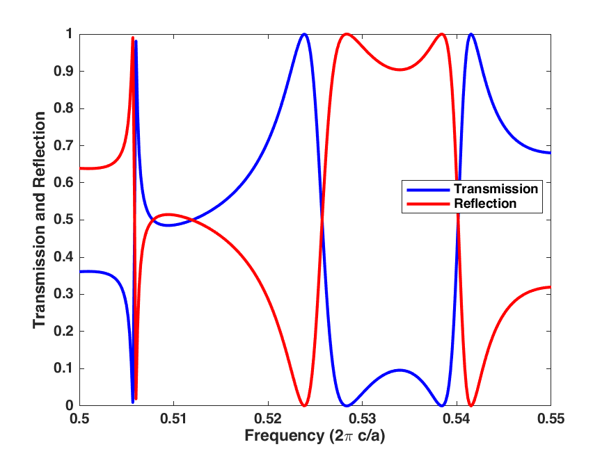
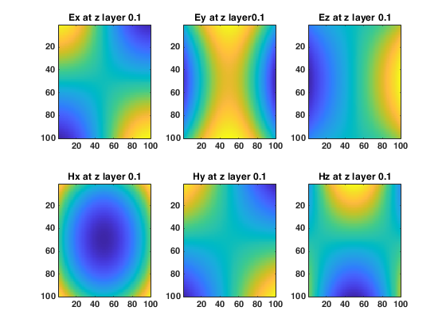

# RCWA
An electromagnetic simulation tool programmed in Matlab by using the method Rigorous Coupled-Wave analysis (RCWA), Originally developed by [Jia LIU](https://github.com/insaliujia/MatRCWA) and then further developed by [Zhaohua Tian](https://knifelees3.github.io/).

For the detailed derivation please consult this: 

[1] Moharam, M. G., & Gaylord, T. K. (1981). Rigorous coupled-wave analysis of planar-grating diffraction. JOSA, 71(7), 811-818.

[2] Rumpf, R. C. (2011). Improved formulation of scattering matrices for semi-analytical methods that is consistent with convention. Progress In Electromagnetics Research B, 35, 241-261.

[3] Liscidini, M., Gerace, D., Andreani, L. C., & Sipe, J. E. (2008). Scattering-matrix analysis of periodically patterned multilayers with asymmetric unit cells and birefringent media. Physical Review B, 77(3), 035324.

I also recommend the following references:

[4] Liu, V. & Fan, S. S4 : A free electromagnetic solver for layered periodic structures. *Computer Physics Communications* **183**, 2233–2244 (2012).

[5] Whittaker, D. M. & Culshaw, I. S. Scattering-matrix treatment of patterned multilayer photonic structures. *Phys. Rev. B* **60**, 2610–2618 (1999).

[6] [Computational Electromagnetics](https://empossible.net/academics/emp5337/)

# User manual
The program use object oriented programming paradigm in Matlab without using any toolboxes. So only a valide version of Matlab is needed to use it. 

## Installation
No installation is need but the path has to be added in Matlab as shown in the examples.

## How to use 

Basic simulation needs will be satisfied by changing parameters in the examples. In case, some explanations are given in this file.

Four Objects are mainly used: RCWA, Source, Device and Material.

  - RCWA is the main object to control the RWA calculation engine.
  - Source is used to define the illumination source. Here only plane wave source can be used. The wavelength, polarization and illumination angle can be controled.
  - Device is used to define the details of the simulated structure. In this program different shapes (cylinder, rectangle etc.) can be included.
  - Material is a seperate object to control materials used in simulation. Users have to include reflective index according to a certain format as shown in the material folder. In addition simple reflective index can be defined directly as the example shown in defining the reflective index of Air.

To use this, functions should be added to path:

```matlab
addpath('material\');
addpath('RCWA\');
addpath('shape\');
```

## Some Example

### The 1D grating

`TEST1D_Python_1DGrating.m`



### The Bragg-Mirror

`TEST1D_Python_BragGratting.m`




### Hole grating

Benchmark with S4 results [4];

`TEST1D_Python_BragGratting.m`






### Field Visualizations

*  Field in specific z planes



*  Field in different planes

  


## Simple explanation of the function

The detailed use should be given in the future, and now I summarize the following simple usage

* Build new RCWA simulation objects

```matlab
% Build new simulation input: ref index [er,ur], trn index [er,ur],waitbar
Simul = RCWA([1,1],[1,1],ShowProcess);
```

* Build new sources

```matlab
% Build source input: [wavelength],[theta(angle with axis XZ),phi(angle in the XY plane)], polarization
S = Source([300:800],[0,0],[1/sqrt(2),1/sqrt(2)]); % 单位是nm
```

* Build new device

```
% Build device input: [length,width],[number in x,number in y](should be in proportion),[spatial harmonics]
% 计算区域元胞的长、宽
D = Device([0.6,0.6],[102,102],[11,11]); % 单位是um
```

* Add layers to the device

```matlab
%AddLayer(Dev,material,length,ilayer)
% Device, Material, thickness，layers
AddLayer(D,Si,0.424,10);
```

* Add patterns to the device

```matlab
% AddPattern(Dev,shape,center,size,nlayer,material)
% Device,Shape,Center,size in x and y,number of layer，material
AddPattern(D,'Pyramid',[0.3,0.3],[0.3,0.3],[1:10],Air);
```

* A waitbar will be used to display the progress and maybe you can't close it in some cases, just try the following command

```matlab
close all force
```

License
----

MIT

